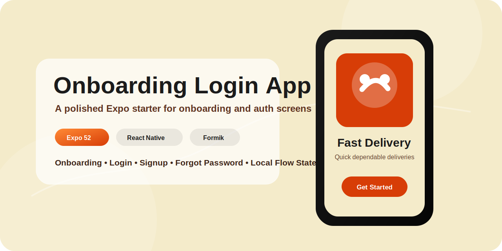
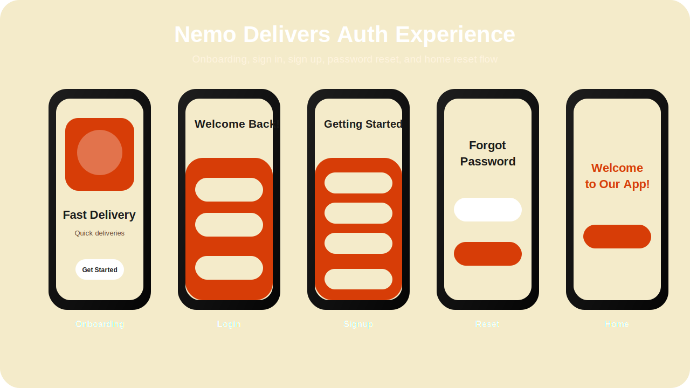
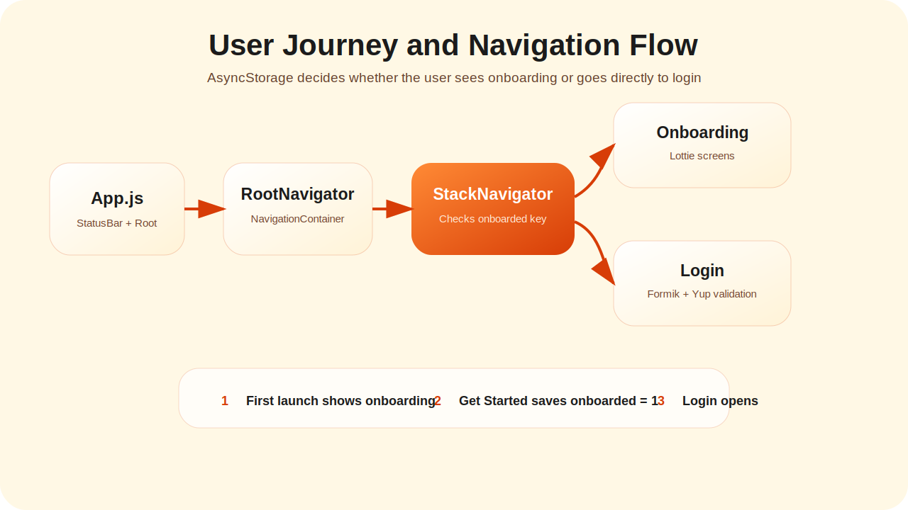

<div align="center">



# 🚚 Onboarding Login App

### A polished Expo onboarding and authentication UI starter for Nemo Delivers

A React Native mobile UI project featuring animated onboarding screens, login, signup, forgot password, local onboarding persistence, form validation, and stack-based navigation.

Built with **Expo**, **React Native**, **React Navigation**, **AsyncStorage**, **Lottie**, **Formik**, and **Yup**.

</div>

---

## Table of Contents

- [Overview](#overview)
- [App Showcase](#app-showcase)
- [Core Features](#core-features)
- [Tech Stack](#tech-stack)
- [System Architecture](#system-architecture)
- [Navigation Flow](#navigation-flow)
- [Onboarding Flow](#onboarding-flow)
- [Authentication UI Flow](#authentication-ui-flow)
- [Validation System](#validation-system)
- [Local Storage Handling](#local-storage-handling)
- [Folder Structure](#folder-structure)
- [Important Files](#important-files)
- [Installation](#installation)
- [Available Scripts](#available-scripts)
- [Future Improvements](#future-improvements)
- [Author](#author)

---

## Overview

**Onboarding Login App** is a focused React Native UI starter designed for the early user journey of a delivery-style mobile application.

The app demonstrates how to structure:

- A first-launch onboarding experience.
- A stack-based navigation system.
- Login and signup forms.
- Forgot password UI.
- Form validation with Formik and Yup.
- Onboarding completion persistence with AsyncStorage.
- A simple home screen with onboarding reset support.

The project is branded around a delivery app concept called **Nemo Delivers**, with onboarding screens for fast delivery, order tracking, and deals.

---

## App Showcase



The app includes the essential screens required for a clean onboarding and authentication user journey.

---

## Core Features

### Animated Onboarding

- Three onboarding slides.
- Lottie animations.
- Custom **Get Started** button.
- Skip and done behavior.
- Delivery-focused onboarding content.

### Local Onboarding Persistence

- Saves onboarding completion using AsyncStorage.
- Prevents onboarding from appearing again after completion.
- Allows onboarding reset from the Home screen.

### Authentication UI

- Login screen.
- Signup screen.
- Forgot password screen.
- Social login button placeholders.
- Password visibility toggle.
- Responsive mobile layout.

### Form Validation

- Email validation.
- Password length validation.
- Required field validation.
- Username validation on signup.
- Formik-powered form state.
- Yup-powered schema validation.

### Navigation

- Root navigation container.
- Stack navigator.
- Conditional initial route based on onboarding state.
- Clean screen transitions.

---

## Tech Stack

### Core

- React Native
- Expo
- JavaScript
- React

### Navigation

- React Navigation Native
- React Navigation Stack
- React Native Screens
- React Native Gesture Handler
- React Native Masked View

### Storage

- AsyncStorage

### Forms and Validation

- Formik
- Yup

### Animations

- Lottie React Native
- React Native Onboarding Swiper

### UI

- React Native StyleSheet
- StatusBar
- Custom reusable Button component
- Custom Header component

---

## System Architecture



```text
App.js
  ↓
RootNavigator
  ↓
NavigationContainer
  ↓
StackNavigator
  ↓
AsyncStorage onboarding check
  ↓
OnboardingScreen OR Login
```

The application keeps the architecture intentionally simple. It is a UI-first starter app where navigation, onboarding state, and form validation are the main responsibilities.

---

## Navigation Flow

```text
RootNavigator
  │
  ▼
NavigationContainer
  │
  ▼
StackNavigator
  │
  ├── OnboardingScreen
  ├── Login
  ├── SignUp
  ├── ForgotPass
  └── Home
```

### Initial Route Logic

```text
Check AsyncStorage key: onboarded
        │
        ├── onboarded === "1"
        │       └── Login
        │
        └── no onboarded value
                └── OnboardingScreen
```

---

## Onboarding Flow

```text
User opens app first time
      │
      ▼
Onboarding screen appears
      │
      ▼
User presses Get Started or Skip
      │
      ▼
AsyncStorage saves onboarded = "1"
      │
      ▼
User navigates to Login screen
```

### Onboarding Slides

| Slide | Title | Purpose |
|---|---|---|
| 1 | Fast Delivery | Introduces quick delivery experience |
| 2 | Order Tracking | Highlights live delivery updates |
| 3 | Great Deals | Promotes offers and rewards |

---

## Authentication UI Flow

### Login Flow

```text
User enters email and password
      │
      ▼
Formik stores form state
      │
      ▼
Yup validates input
      │
      ▼
Valid form navigates to Home
```

### Signup Flow

```text
User enters username, email, and password
      │
      ▼
Formik stores form state
      │
      ▼
Yup validates input
      │
      ▼
Valid form navigates to Home
```

### Forgot Password Flow

```text
User enters email
      │
      ▼
Yup validates email
      │
      ▼
Reset action logs the submitted email
```

> Note: This project currently implements authentication screens and local validation only. It does not connect to Firebase, Supabase, or a production backend authentication service yet.

---

## Validation System

The app uses **Formik** for form state and **Yup** for validation schemas.

### Login Validation

```text
email: required + valid email format
password: required + minimum 6 characters
```

### Signup Validation

```text
username: required
email: required + valid email format
password: required + minimum 6 characters
```

### Forgot Password Validation

```text
email: required + valid email format
```

---

## Local Storage Handling

AsyncStorage is used for onboarding state.

### Storage Key

```text
onboarded
```

### Storage Values

```text
"1" = onboarding completed
null = onboarding should be shown
```

### Helper Functions

```text
setItem(key, value)
getItem(key)
removeItem(key)
```

The Home screen includes a reset button that removes the onboarding flag and navigates back to the onboarding screen.

---

## Folder Structure

```text
Onboarding-login-app/
├── assets/
│   ├── animations/
│   │   ├── animation1.json
│   │   ├── animation2.json
│   │   └── animation3.json
│   │
│   ├── readme/
│   │   ├── hero-banner.svg
│   │   ├── app-flow.svg
│   │   └── screen-showcase.svg
│   │
│   ├── google.png
│   └── facebook.png
│
├── Components/
│   ├── Button
│   └── Header
│
├── global/
│   ├── AysyncStorage.js
│   └── styles.js
│
├── screens/
│   ├── Navigation/
│   │   ├── RootNavigator.js
│   │   └── StackNavigator.js
│   │
│   ├── Onboarding.js
│   ├── Login.js
│   ├── SignUp.js
│   ├── Forgotpass.js
│   └── Home.js
│
├── App.js
├── package.json
└── README.md
```

---

## Important Files

### App.js

Main application entry. It renders the global container, applies the status bar color, and mounts the root navigator.

### RootNavigator.js

Wraps the application inside `NavigationContainer` and renders `StackNavigator`.

### StackNavigator.js

Controls screen routing and decides the first screen based on AsyncStorage onboarding state.

### Onboarding.js

Renders the three onboarding slides using `react-native-onboarding-swiper` and Lottie animations.

### Login.js

Renders the login form with Formik/Yup validation, password visibility toggle, forgot password navigation, social login placeholders, and navigation to signup.

### SignUp.js

Renders the signup form with username, email, password validation, social signup placeholders, and navigation back to login.

### Forgotpass.js

Renders a simple password reset form with email validation.

### Home.js

Displays a welcome message and provides a button to reset onboarding state for testing the full first-launch flow again.

---

## Installation

```bash
git clone https://github.com/codewithmoju/Onboarding-login-app.git
cd Onboarding-login-app
npm install
```

---

## Available Scripts

### Start Expo

```bash
npm start
```

### Android

```bash
npm run android
```

### iOS

```bash
npm run ios
```

### Web

```bash
npm run web
```

---

## Future Improvements

- Connect login/signup to Firebase Authentication.
- Add real forgot password email flow.
- Add Google/Facebook authentication.
- Add secure auth session handling.
- Add loading indicators during form submission.
- Add success/error toast messages.
- Fix typo in `AysyncStorage.js` to `AsyncStorage.js`.
- Add TypeScript support.
- Add reusable input component.
- Add accessibility improvements.
- Add real app screenshots or GIF demo.
- Add testing setup.

---

## Engineering Highlights

This repository demonstrates:

- Expo app setup.
- React Navigation stack routing.
- First-launch onboarding logic.
- AsyncStorage persistence.
- Lottie-based onboarding animations.
- Formik form state handling.
- Yup validation schemas.
- Reusable UI components.
- Mobile-first auth screen design.

---

## Author

**Muhammad Moaiz**  
React Native Developer  
Expo • React Native • Mobile UI Engineering

---

## License

This project is available for learning, portfolio, and demonstration purposes.
